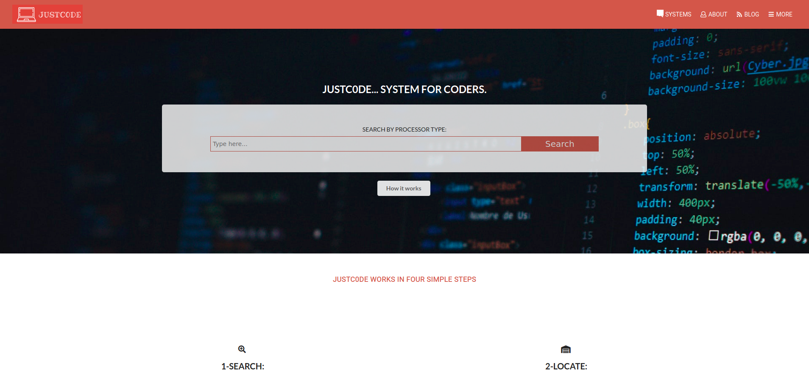

# Laptop-Directory

HTML/CSS Capstone Project

> What the project is about

It is a final project under HTML & CSS
Building an original personal project

> How the project was done

Use semantic HTML tags
Use SASS
Use CSS selectors to style
Use Bootstrap
Use flexbox and grid to position elements.

## Built With

- html, css
- bootstrap
- vscode

## Live Demo

[Live Demo Link](https://rawcdn.githack.com/jstloyal/Laptop-Directory/8cfa3b1d707f4bb8a3e229c6122fa9b06b43da61/index.html)

## Getting Started

To get a local copy up and running follow these simple example steps.

### Prerequisites

- Web browser
- Code editor
- Git and Github

### Usage

- Clone the project to your local machine
- Open the index file in your browser

## Authors

- Adetayo Sunkanmi

👤 **Author**

- Github: [Adetayo Sunkanmi](https://github.com/jstloyal)
- Twitter: [Adetayo Sunkanmi](https://twitter.com/jstloyalty)
- Linkedin: [Adetayo Sunkanmi](https://www.linkedin.com/in/jstloyalty/)

## 🤝 Contributing

Feel free to check the [issues page](https://github.com/jstloyal/Laptop-Directory/issues).

Contributions, issues and feature requests are welcome!

Start by:

- Forking the project
- Cloning the project to your local machine
- `cd` into the project directory
- Run `git checkout -b your-branch-name`
- Make your contributions
- Push your branch up to your forked repository
- Open a Pull Request with a detailed description to the development branch of the original project for a review

## Show your support

Give a ⭐️ if you like this project!

## Acknowledgments

- Google
- w3school

## 📝 License

This project is [MIT](lic.url) licensed.
